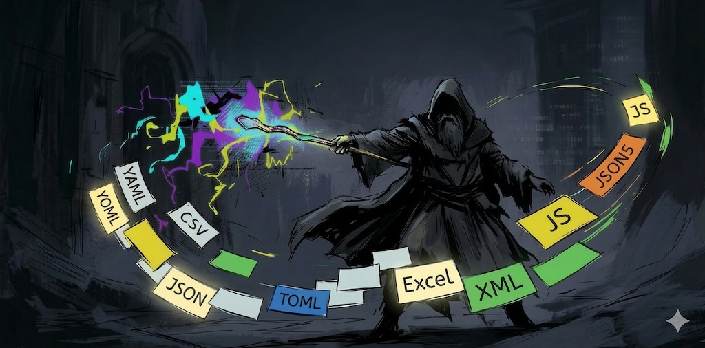

# Archmage

This is the runtime library for the [Archmage](https://archmage.shadop.dev/) game
configuration system, which loads and manages configurations from JSON files with
support for i18n, cross-table references, durations, and data types ranging from
primitives to recursive structures.

It is built around the concept of an **Atlas** — a registry that maps named keys
to configurations. Each key points to one or more JSON files; **Archmage** reads
and deserializes them into generated C# objects, resolves cross-table references,
and calls post-load hooks.

**Key features**:

- **I18n** for multi-language text management with automatic fallback
- **XRef** for cross-table reference resolution via `IAtlas.BindRefs`
- **Duration** with nanosecond precision and compact JSON array encoding
- **Whitelist / blacklist** to load only a subset of items
- **Layered overrides**: additional directories or filesystems supply JSON that
  is merged into the base data at load time, field by field
- **Unity support**: built-in adapters for Addressables, Resources, and StreamingAssets

## Requirements

### Unity

- Unity 6000.3 or later
- com.unity.nuget.newtonsoft-json 3.2.2

### .NET

- net8.0, netstandard2.1 or later
- Newtonsoft.Json 13.0.4

## Installation

### Unity

**Via GitHub** — In the Package Manager window, click **+** → **Add package from git URL**, and enter:

```
https://github.com/shadowopera/sdk-cs.git?path=unity/dev.shadop.archmage
```

**Or via OpenUPM**:

```bash
openupm add dev.shadop.archmage
```

> [!NOTE]
> **Unity Signature Warning**: Unity may display a "Missing Signature" warning. This is expected for OpenUPM packages. Archmage is safe to use - the warning does not affect functionality. Simply proceed with your development as usual.

If your project uses `.asmdef` files, add the following assembly references:

- `Shadop.Archmage.Sdk`
- `Shadop.Archmage.Sdk.Unity`
- `Shadop.Archmage.Sdk.Unity.Addressables` *(optional, only if using Addressables)*

### .NET (via NuGet)

```bash
dotnet add package Shadop.Archmage
```

## Getting Started

### Unity (Addressables)

A complete working example is in [`ConfLoader.cs`](https://github.com/shadowopera/sdk-cs/blob/main/unity/ArchmageDev/Assets/Scripts/ConfLoader.cs), covering Addressables, Resources, and StreamingAssets — with sync/async variants, concurrent loading, and I18n setup.

The recommended starting point:

```csharp
using Shadop.Archmage.Sdk;

// ConfigAtlas is generated by the archmage tool
var atlas = new ConfigAtlas();
var options = new AtlasOptions()
    .WithLogger(new UnityAtlasLogger())
    .WithJsonSettings(UnityJsonSettingsFactory.Create())
    .WithFS(new UnityAddressablesFS());

await Archmage.LoadAtlasAsync(
    "Assets/Configs/atlas.json", "Assets/Configs", atlas, options);
```

### .NET

```csharp
using Shadop.Archmage.Sdk;

// ConfigAtlas is generated by the archmage tool
var atlas = new ConfigAtlas();
Archmage.LoadAtlas("configs/atlas.json", "configs/", atlas);
```

## Concepts

`atlas.json` is generated by the ***archmage*** tool. It declares how each
config key maps to its JSON files using one of three strategies:

| Strategy | Shape | Behavior |
|---|---|---|
| unique | `key → "file.json"` | Deserializes one file into the config object |
| single | `key → { "/": "file.json", "alt": "file-alt.json" }` | Selects one file by case; `"/"` is the default |
| multiple | `key → ["a.json", "b.json"]` | Deserializes and merges multiple files in order |

Example `atlas.json`:

```json
{
    "unique": {
        "hero": "hero.json",
        "item": "clutter/item.json"
    },
    "single": {
        "game": { "/": "game.json", "hard": "game_hard.json" }
    },
    "multiple": {
        "weapon": [ "vtbl/weapon-sword.json", "vtbl/weapon-staff.json" ]
    }
}
```

## Loading Configs

Loading proceeds in the following steps:

1. Parse `atlas.json`
2. Apply `AtlasModifier` (if set)
3. For each item: read files → deserialize → apply overrides
4. `BindRefs()` — resolve cross-table references
5. `OnLoaded()` — post-load initialization

## AtlasOptions

Configure loading via the fluent `AtlasOptions` builder:

```csharp
var opts = new AtlasOptions()
    // custom logger (default: console)
    .WithLogger(myLogger)
    // custom filesystem for reading base config files (default: System.IO)
    .WithFS(myFS)
    // load only these keys
    .WithWhitelist(new[] { "hero", "item" })
    // skip these keys
    .WithBlacklist(new[] { "debug" })
    // add an override directory
    .WithOverrideRoot("configs/override/")
    // add an override filesystem
    .WithOverrideFS(embeddedFS)
    // mutate atlas.json after parsing
    .WithAtlasModifier(atlasJson => { ... })
    // custom Newtonsoft.Json settings
    .WithJsonSettings(customSettings);
```

**Whitelist / Blacklist** — If a whitelist is set, only listed keys are loaded (blacklist
is ignored). All keys must exist in the atlas or an exception is thrown.

**Override layers** — Each `WithOverrideRoot` / `WithOverrideFS` call adds another
override source. When loading an item, each override source is checked in the order they
were added; any matching file is deserialized and its fields applied on top of the base
data. This is useful for environment-specific patches.

Field-level merge rules during override processing:

| Value in override | Behavior |
|---|---|
| `null` | Resets the target field to its default value or raise an exception |
| JSON object | Recursively merges — only fields present in the override are updated, others remain unchanged |
| Any other value | Overwrites the field |

**Custom load strategy** — By default, items are loaded one by one in alphabetical order.
`WithLoadStrategy` and `WithAsyncLoadStrategy` let you take control of that loop —
for example to load items in parallel:

```csharp
// Parallel sync
var opts = new AtlasOptions().WithLoadStrategy((items, load) =>
    Parallel.ForEach(items, kvp => load(kvp.Key, kvp.Value)));

// Parallel async
var opts = new AtlasOptions().WithAsyncLoadStrategy(async (items, loadAsync, ct) =>
    await Task.WhenAll(items.Select(kvp => loadAsync(kvp.Key, kvp.Value, ct))));
```

## Custom File System

Both `WithFS` and `WithOverrideFS` accept an `IFS` implementation. The default
filesystem reads from `System.IO`. You can supply a custom `IFS` to replace it or
to use as an override source — for example to load from embedded resources or
an in-memory dictionary:

```csharp
class EmbeddedFS : IFS
{
    public bool DirectoryExists(string path) => true;
    public bool FileExists(string path) => /* check assembly resources */;
    public byte[] ReadAllBytes(string path) => /* load from resources */;
    public Task<byte[]> ReadAllBytesAsync(string path, CancellationToken ct) => /* async load */;
}

var opts = new AtlasOptions().WithFS(new EmbeddedFS());
```

## Special Types

### I18n — Localization

`I18n` holds per-language translations and falls back to a default language when a key is missing.

```csharp
var i18n = new I18n(fallbackLanguage: "en");
i18n.MergeL10nFile("l10n/en.json", "en");
i18n.MergeL10nFile("l10n/zh-CN.json", "zh-CN");

i18n.Text("ui.ok", "zh-CN");  // → "确认"
i18n.Text("ui.ok", "ja");     // → falls back to "OK"
```

In generated config classes, localized fields are typed as `L10n`. In JSON they are
represented as strings (e.g., `"ui.ok"`); accessing `.Text` on an `L10n` field looks up
that key in a shared `I18n` instance. Set `L10n.GetI18n` and `L10n.GetPreferredLanguage`
to configure the lookup before use.

```csharp
L10n.GetI18n = () => i18n;
L10n.GetPreferredLanguage = () => "zh-CN";

// Then in your code:
string label = hero.Name.Text;
```

### XRef — Cross-table Reference

`XRef<V, T>` pairs a config ID (`CfgId`) with a resolved reference (`Ref`) set during `BindRefs`.

```csharp
// In generated config class:
public XRef<HeroCfgId, HeroCfg> Boss { get; set; }

// After loading:
var boss = atlas.HeroTable[1].Boss.Ref;   // resolved object
```

### Duration

A nanosecond-precision duration type. It serializes as a compact integer array in JSON (e.g., `[0, 5]` = 5 seconds).

```csharp
Duration d = Duration.Second * 90 + Duration.Millisecond * 500;
d.ToString();      // "1m30s500ms"
d.Seconds();       // 90.5
d.Milliseconds();  // 90500
d.ToTimeSpan();    // TimeSpan
```

Arithmetic operators (`+`, `-`, `*`, `/`, `%`) and comparisons are supported.

### Rgba

A color type with `R`, `G`, `B`, `A` byte channels. In Unity, `.ToColor()`
converts it to `UnityEngine.Color`.

```csharp
var color = Rgba.Parse("#FF8000");   // R=255, G=128, B=0, A=255
color.ToString();                    // "#FF8000"
```

### Tup

`Tup1`–`Tup7` are heterogeneous tuples. They serialize as JSON objects with keys
`item0`, `item1`, etc. (0-based). Fields are accessed as `.Item0`, `.Item1`, etc.,
and deconstruction is supported.

### Vec

`Vec2<T>`, `Vec3<T>`, `Vec4<T>` are typed vectors. Fields are accessed as `.X`, `.Y`, `.Z`, `.W`.

## Data Versioning

`atlas.json` can carry a `version` block with VCS metadata (branch, commit ID, timestamp, author). After loading, it is available on the atlas:

```json
{
    "version": {
        "branch": "main",
        "id": "a1b2c3d4e5f6...",
        "shortId": "a1b2c3d",
        "timestamp": "2025-01-01T00:00:00Z"
    },
    ...
}
```

```csharp
var ver = atlas.DataVersion;   // VersionInfo?, null if not present
ver?.Branch   // "main"
ver?.ShortID  // "a1b2c3d"
```

---

## Development

### Project Structure

```
sdk-cs/
├── src/Archmage/Sdk/               # C# source (canonical)
│   └── Unity/                      # Unity-specific adapters (FS, Logger)
├── unity/
│   ├── ArchmageDev/                # Unity demo & development project
│   └── dev.shadop.archmage/        # Unity package (OpenUPM)
│       └── Runtime/                # Synced from src/Archmage/
├── scripts/
│   └── rsync-unity.sh              # src/ → unity/.../Runtime/ sync
└── tests/                          # xunit.v3 tests + generated Conf/ fixtures
```

### Build & Test

```bash
dotnet build src/Archmage/Archmage.csproj
dotnet test tests/Archmage.Tests.csproj
dotnet test tests/Archmage.Tests.csproj --filter "FullyQualifiedName~TestName"
UPDATE_GOLDEN=1 dotnet test tests/Archmage.Tests.csproj   # regenerate golden files
```

### Sync to Unity

```bash
scripts/rsync-unity.sh
```

## License

Apache 2.0. See [LICENSE](LICENSE) for details.
