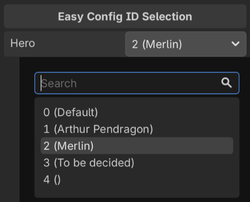

Archmage can display config ID properties in the Inspector as dropdowns. This is useful when you set the value of a config ID property in the Inspector. Without dropdowns, you must look up each ID in a config table and enter it manually. A mistyped ID can go unnoticed until the game runs. With a dropdown, you select the ID from a searchable list of the table's IDs, and the list can show a name next to each ID.



`archmage struct` generates the dropdown code with the `godot-editor` template. The generated code is a Godot editor plugin, `ArchmageEditorPlugin`, which has two roles: it loads the configs in the editor, and it provides a custom inspector control that renders each config ID property as a dropdown.

## Generate the Code

Run `archmage struct` with the same arguments as for the config code, but with a different `-t`, `--namespace` and `-o`:

```bash
archmage struct -t godot-editor --namespace Conf.Editor \
    -o addons/archmage hero.xlsx race.xlsx
```

- `--namespace` must be the namespace of the config code or a namespace inside it, because the generated code uses the config types without any `using` directives.
- `-o` must be a folder inside `addons/`, where Godot looks for plugins.

Run the command each time you generate the config code.

## Enable the Plugin

Build the project, then enable the Archmage plugin in **Project > Project Settings > Plugins**.

## Load the Configs

In the `ReloadGameConfigs` method of `ArchmageEditorPlugin.cs`, replace the `TODO` comment and the `TODO` log with code that loads the configs synchronously and sets `ConfigAtlas.Instance`:

```csharp
// Replace "res://configs" with your actual config directory.
const string cfgRoot = "res://configs";
var atlas = new ConfigAtlas();
var options = new AtlasOptions()
    .WithLogger(new GodotAtlasLogger())
    .WithJsonSettings(GodotJsonSettingsFactory.Create())
    .WithFS(new GodotFileAccessFS());
Archmage.LoadAtlas($"{cfgRoot}/atlas.json", cfgRoot, atlas, options);
ConfigAtlas.Instance = atlas;
```

The configs are loaded when the Inspector first displays an object. After each build, they are reloaded the next time the Inspector displays an object. To load changed config files manually, choose **Project > Tools > Reload Game Configs for Editor**. The editor only uses updated C# code after a build. Saving a `.cs` file does not trigger a build.

## Define Config ID Properties

A property shows as a dropdown when its hint string is the name of a config ID type, such as `HeroCfgId`, and its type is `long` for an integer ID or `string` for a string ID:

```csharp
[Export(PropertyHint.None, "HeroCfgId")]
public long Hero { get; set; }

[Export(PropertyHint.None, "RaceCfgId")]
public string Race { get; set; } = "";
```

For an array of config IDs, use `long[]` or `string[]` with `PropertyHint.TypeString`. Each element also shows as a dropdown. `Godot.Collections.Array<T>` does not show dropdowns, because Godot drops its hint string.

```csharp
[Export(PropertyHint.TypeString, "2/0:HeroCfgId")]
public long[] Heroes { get; set; } = Array.Empty<long>();

[Export(PropertyHint.TypeString, "4/0:RaceCfgId")]
public string[] Races { get; set; } = Array.Empty<string>();
```

## Show More Than Just the ID

By default, each dropdown shows only the IDs. To show more, register the ID's choices with a display formatter in `InitializeCfgIdChoices`, after `RegisterDefaultCfgIdChoices`:

```csharp
HeroCfgIdChoices.Register(atlas.HeroTable,
    v => $"{v} ({new HeroCfgId(v).Cfg.Name.Text})");
```

If the formatter reads localized text, such as `Cfg.Name.Text`, the load code must also set [`L10n.GetI18n`](../../gen-cs/conf-l10n/#geti18n) and [`L10n.GetPreferredLanguage`](../../gen-cs/conf-l10n/#getpreferredlanguage).
