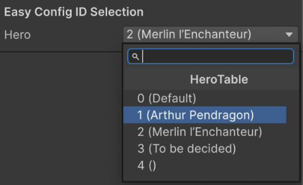

Archmage can display config ID fields in the Inspector as dropdowns. Without dropdowns, you must look up each ID in a config table and enter it manually. A mistyped ID can go unnoticed until the game runs. With a dropdown, you select the ID from a searchable list of the table's IDs, and the list can show a name next to each ID.



`archmage struct` generates the dropdown code with the `unity-editor` template. The generated code has two parts: `ArchmageEditorTools`, which loads the configs in the Unity Editor, and a property drawer for each config ID type.

## Generate the Code

Run `archmage struct` with the same arguments as for the config code, but with a different `-t`, `--namespace` and `-o`:

```bash
archmage struct -t unity-editor --namespace Conf.Editor \
    -o Assets/Editor hero.xlsx race.xlsx
```

- `--namespace` must be the namespace of the config code or a namespace inside it, because the generated code uses the config types without any `using` directives.
- `-o` must be either an `Editor` folder or a subfolder inside it.

Run the command each time you generate the config code.

## Load the Configs

In the `Initialize` method of `ArchmageEditorTools.cs`, replace the `TODO` comment and the `TODO` log with code that loads the configs synchronously and sets `ConfigAtlas.Instance`:

```csharp
// Replace "Assets/Configs" with your actual config directory.
const string cfgRoot = "Assets/Configs";
var atlas = new ConfigAtlas();
var options = new AtlasOptions()
    .WithLogger(new UnityAtlasLogger())
    .WithJsonSettings(UnityJsonSettingsFactory.Create());
Archmage.LoadAtlas($"{cfgRoot}/atlas.json", cfgRoot, atlas, options);
ConfigAtlas.Instance = atlas;
```

The configs are loaded when the Unity Editor starts and are reloaded after each script compilation. To load changed config files manually, choose **Tools > Reload Game Configs for Editor**. In Play Mode, once the game sets `ConfigAtlas.Instance`, the dropdowns show the IDs of the configs that the game loads.

## Define Config ID Fields

A field of a config ID type, such as `HeroCfgId`, shows as a dropdown. In an array or a list of a config ID type, each element also shows as a dropdown:

```csharp
public HeroCfgId Hero;
public RaceCfgId Race;
public HeroCfgId[] Heroes;
public List<RaceCfgId> Races;
```

## Show More Than Just the ID

By default, each dropdown shows only the IDs. To show more, initialize the ID's drawer with a display formatter in `InitializeCfgIdDrawers`, after `RegisterDefaultCfgIdDrawers`:

```csharp
HeroCfgIdDrawer.Initialize(atlas.HeroTable,
    v => $"{v} ({new HeroCfgId(v).Cfg.Name.Text})");
```

If the formatter reads localized text, such as `Cfg.Name.Text`, the load code must also set [`L10n.GetI18n`](../../gen-cs/conf-l10n/#geti18n) and [`L10n.GetPreferredLanguage`](../../gen-cs/conf-l10n/#getpreferredlanguage).
